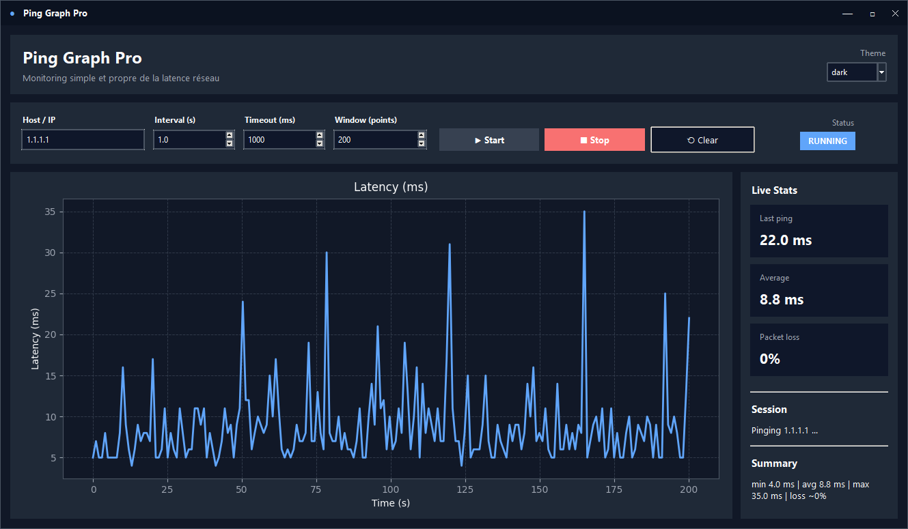
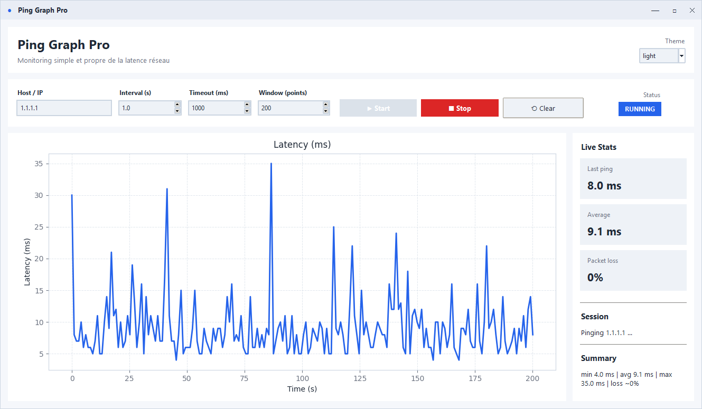

# Ping Graph Pro


A modern desktop ping monitor built with **Python**, **Tkinter**, and **Matplotlib**.

Ping Graph Pro lets you monitor network latency in real time through a clean UI, a live graph, dark/light themes, and a custom borderless window with manual drag, resize, minimize, and maximize support.

---

## Features

- Real-time ping monitoring
- Live latency graph
- Packet loss estimation
- Configurable host / IP
- Configurable interval and timeout
- Adjustable graph window size
- Dark / light theme switch
- Custom title bar
- Manual window drag
- Manual window resize from edges and corners
- Minimize / maximize / restore support
- Double-click title bar to maximize / restore
- Clean desktop-style UI with live stats panel

---

## Requirements

- Python 3.9+
- matplotlib

---

## Installation

```bash
git clone https://github.com/yourusername/ping-graph-pro.git
cd ping-graph-pro
pip install matplotlib
```

---

## Run

```bash
python ping_graph_pro.py
```

---

## Usage

### Enter a Host / IP

Example: `1.1.1.1`, `8.8.8.8`, or a hostname such as `google.com`

### Set:

- **Interval (s)**: delay between pings  
- **Timeout (ms)**: ping timeout  
- **Window (points)**: number of points displayed on the graph  

### Start monitoring

Click **Start**

### Watch:

- the live graph  
- the last ping  
- the average latency  
- estimated packet loss  

### Stop / Reset

- Click **Stop** to stop monitoring  
- Click **Clear** to reset the graph and stats  

---

## Window Controls

This application uses a **custom borderless window**.

### Supported actions

- Drag the window from the top title bar  
- Double-click the title bar to maximize / restore  
- Resize from:
  - left edge  
  - right edge  
  - top edge  
  - bottom edge  
  - all four corners  
- Minimize with the top-right **—** button  
- Maximize / restore with the **□ / ❐** button  
- Close with the **✕** button  

---

## Themes

Ping Graph Pro supports:

- dark  
- light  

You can switch themes directly from the UI using the theme selector.

The selected theme is applied to:

- the main window  
- panels and controls  
- title bar  
- live graph  
- labels and buttons  

---

## How it works

The application starts a background worker thread that periodically runs the system `ping` command:

### On Windows:
```
ping -n 1 -w <timeout_ms>
```

### On Linux/macOS:
```
ping -c 1 -W <timeout>
```

Latency values are parsed from the command output and pushed into a thread-safe queue.

The Tkinter UI consumes these results and updates:

- the graph  
- the live statistics  
- the status text  

Timeouts are represented as missing values and shown as breaks in the graph.

---

## Statistics

The application computes live statistics over the currently displayed window:

- min  
- avg  
- max  
- estimated packet loss  

Timeouts are excluded from latency averages and min/max calculations.

---

## Project Structure

```
ping_graph_pro.py
README.md
```

---

## Notes

- The app relies on the system `ping` command being available  
- Some behavior may vary slightly depending on the operating system  
- Borderless custom windows are always a little less native than standard OS windows  
- On Windows, minimizing and maximizing may briefly restore native window decorations  

---

## Example Use Cases

- Monitor internet latency in real time  
- Check packet loss on unstable connections  
- Observe latency spikes while gaming  
- Validate Wi-Fi or VPN stability  
- Monitor a router, DNS server, or remote host  

---

## Known Limitations

- The app does not currently persist settings between sessions  
- No export feature yet for graph data  
- No multi-host monitoring yet  
- Native window snapping is not as perfect as a fully native Win32 application  

---

## Roadmap Ideas

- Settings persistence  
- CSV export  
- Multiple host monitoring  
- Alert thresholds  
- Sound / desktop notifications  
- Theme persistence  
- Tray icon support  
- Native Windows visual enhancements via Win32 APIs  

---

## Release Notes Template

### Highlights

- Added modern custom UI  
- Added dark / light themes  
- Added custom borderless title bar  
- Added drag, resize, minimize, maximize, and restore support  
- Improved graph presentation and live stats display  

### Improvements

- Cleaner layout  
- Better graph integration  
- Better status feedback  
- More desktop-like user experience  

### Technical Notes

- Built with Tkinter and Matplotlib  
- Uses a background thread for ping execution  
- Parses ping output on Windows and Unix-like systems  

---

## License

MIT License

---

## Author

Created by Naamah
